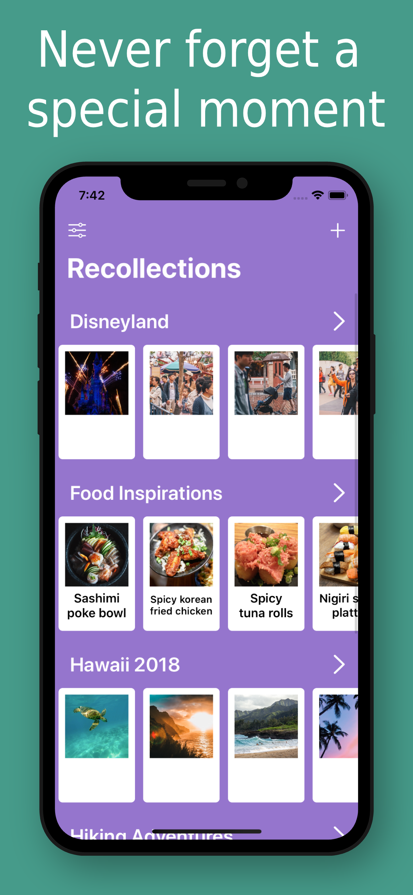

# Recollections
## Overview
Recollections makes it easy to organize your special memories in one place.

Add events to help categorize your memories. Save your memories as photos by uploading a photo from your photo library or taking a picture directly from within the app. Revisit your favorite vacations any time you want. Add captions to your photos and share puppy pictures with your friends. Flip the photo over and write notes to better remember this special memory in the future.

Worried about your privacy? Good news! Recollections does not collect or store any of your personal data. Everything is stored locally on your device, and only on your device.

Now available for iOS 13.0+ in the App Store on iPhone and iPad: 
https://apps.apple.com/us/app/recollections-good-times/id1505236613

    

## Technical Requirements
* iOS Version 13.0+
* Xcode Version 11.3
* Swift Version 5

## Build Instructions
1. Download the project's ZIP file and extract the project's files
2. Open the Recollections-master folder and click on the Recollections.xcodeproj file
3. Select a physical iPhone or an iPhone simulator
4. Click the play button to build and run the app 

## Detailed Walkthrough
Upon opening the app, the default background color is purple. The user can change the background color through settings on the top left corner. On the top right corner, the user can add a new event.

 

Inside the event screen, the user has access to options such as changing the event name or deleting the event entirely. The user is also able to add a new memory using the add button.

  

Only a photo is required to save the memory. A name and notes are optional. The photo is either uploaded with photo library or taken with a camera if the device has one. The user can save the newly cropped photo to their photo library or save the memory, which will bring them back to the event screen.

  

The user now has options to select multiple memories to copy to another event, delete memories, change the event name, or delete the event altogether.

  

Opening a photo, the user can see the other memories on the bottom, if there are any. Clicking on the image will allow the user to zoom in on the image.

  

The user can edit or delete the photo at any time. Using the activity view, the user may also save the image to their photo library or share it via other apps.

  
